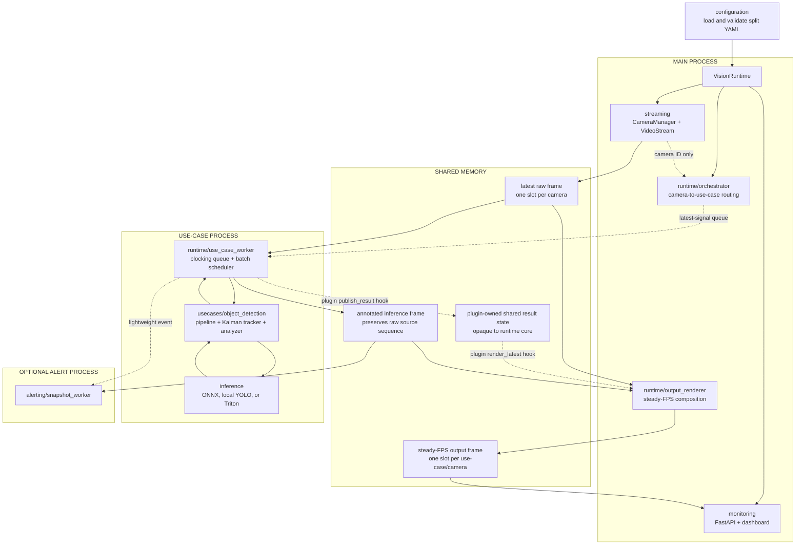
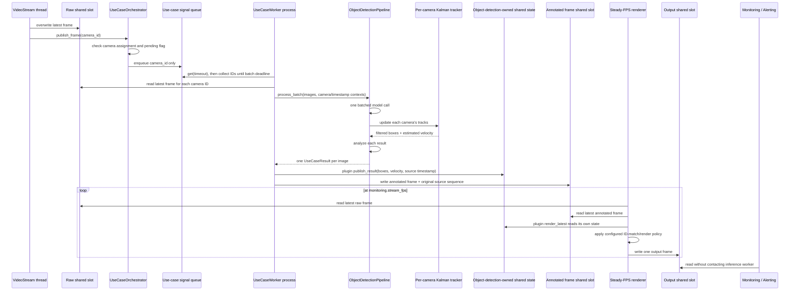
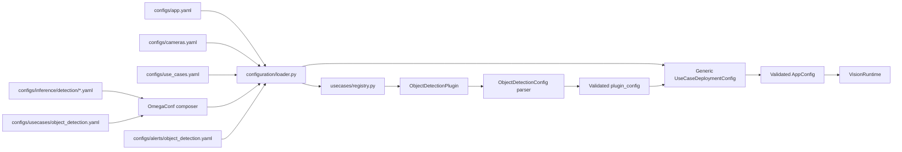

# Vision Stream Lab

Research runtime for multiple video files/cameras, true batched object detection, and live monitoring.

Phase 1 contains one use case: `object_detection`. The runtime already supports multiple use cases without changing camera capture, shared memory, monitoring, or process lifecycle code.

## Architecture

The repository is organized by responsibility. A folder owns one subsystem; there is no generic `common` folder.



### Module ownership

| Module | Owns | Does not own |
|---|---|---|
| `streaming` | Camera lifecycle, OpenCV reading, reconnect/loop, capture FPS | Models, use-case rules, alert encoding |
| `runtime` | Shared image frames, opaque plugin-state transport, camera routing, queues, worker processes, batching | Prediction schemas, YOLO details and business logic |
| `inference` | Detector contract and local/Triton/noop implementations | Camera threads and alert rules |
| `usecases` | Plugin registry, plugin-owned config schemas, pipeline composition, rendering and business rules | Multiprocessing lifecycle |
| `alerting` | Snapshot/file output in a separate process | Inference |
| `monitoring` | Status API, MJPEG output streams, camera-wall client | Camera/model ownership |
| `configuration` | Composing and validating YAML files | Runtime mutation |
| `schema` / `enums` | Stable contracts shared between modules | Processing logic |

Local video simulation is implemented in `streaming/camera_simulator.py`. It only
creates normal camera definitions; after initialization, simulated cameras follow
the exact same capture, shared-memory, routing, batching, and monitoring flow as
webcams or RTSP streams.

### Process model

```text
Main process
|- VisionRuntime
|- CameraManager
|  |- VideoStream(camera-01) thread
|  `- VideoStream(camera-02) thread
|- UseCaseOrchestrator
|- UseCaseOutputRenderer thread per use case
`- FastAPI monitoring

Object-detection process
`- UseCaseWorker
   `- ObjectDetectionPipeline
      |- DetectionBackend
      |- PerCameraKalmanTracker (optional/off by default)
      `- ObjectDetectionAnalyzer

Optional alert process
`- SnapshotAlertWorker
```

`UseCaseWorker` is an object running inside a physical OS process. `ObjectDetectionPipeline` is the use-case logic object inside that worker.

## Frame flow



Important behavior:

- NumPy frames are never serialized through a multiprocessing queue.
- Queues contain small camera IDs only.
- Each use-case/camera pair has at most one pending signal.
- New frames overwrite old shared slots, so stale frames do not build a backlog.
- The worker uses blocking `Queue.get(timeout=...)`, not an empty busy-loop.
- Multiple cameras are sent to YOLO/Triton in one real batch call.
- Generic runtime/schema code never assumes boxes, velocities, OCR text, poses, or
  any other plugin result layout. Each plugin allocates, publishes, reads, and
  renders its own shared result state.
- Output cadence is independent from inference cadence.
- `delayed_matched` buffers raw and inferred frames, delays playback by a bounded interval, and joins them by camera-local source sequence.
- `latest_predictions` motion-compensates the newest non-expired boxes to the current raw-frame timestamp before overlaying them.
- Kalman tracking is lightweight post-processing inside `object_detection`; it is not a second model call or a second inference process.
- Expired predictions fall back to raw video instead of leaving frozen boxes onscreen.
- Monitoring JPEG and alert snapshot work do not run in the inference process.

The design prioritizes realtime freshness. Under load, `inference_fps` can be lower than `capture_fps`, but processed frames stay close to the latest captured frame.

## Repository layout

```text
src/vision_stream_lab/
|- main.py
|- streaming/
|  |- manager.py
|  |- camera_simulator.py
|  `- video_stream.py
|- runtime/
|  |- orchestrator.py
|  |- shared_frames.py
|  `- use_case_worker.py
|- inference/
|  |- core/base.py
|  `- detection/
|     |- base.py
|     |- config.py
|     |- schema.py
|     |- factory.py
|     |- noop.py
|     `- yolo/
|        |- preprocessing.py
|        |- postprocessing.py
|        |- onnx.py
|        |- ultralytics.py
|        `- triton.py
|- usecases/
|  |- base.py
|  |- plugin.py
|  |- registry.py
|  `- object_detection/
|     |- config.py
|     |- plugin.py
|     |- pipeline.py
|     |- state.py
|     |- rendering.py
|     |- tracker.py
|     `- analyzer.py
|- alerting/
|  `- snapshot_worker.py
|- monitoring/
|  |- api.py
|  `- frontend/
|     |- index.html
|     |- styles.css
|     `- app.js
|- configuration/
|  `- loader.py
|- schema/                    # runtime-wide contracts only
`- enums/                     # runtime-wide enums only
```

## Configuration flow

Configuration retains the split-file style of the source repository and uses
OmegaConf for deep composition and interpolation. Hydra is intentionally not part
of the runtime.



The generic loader validates deployment concerns (`id`, `type`, cameras, enabled
state, and alert side effects). It does not know fields such as `tracker`, model
count, zones, or business thresholds. The selected plugin receives its raw
algorithm YAML and returns a typed, validated `plugin_config`. Unknown plugin
fields fail during startup instead of surfacing later inside a worker process.

```text
configs/
|- app.yaml
|- cameras.yaml
|- use_cases.yaml
|- inference/
|  `- detection/
|     `- yolo11n_onnx.yaml
|- usecases/
|  `- object_detection.yaml
|- alerts/
|  `- object_detection.yaml
`- zones/
```

### Application settings

`configs/app.yaml` owns use-case runtime defaults, frame dimensions, monitoring,
sharding, and references to the other config files. A deployment may override
only the runtime fields that differ from those app-level defaults.

```yaml
runtime:
  batch_size: 4
  batch_wait_ms: 12
  queue_timeout_ms: 250
  shard_index: 0
  shard_count: 1

frame:
  width: 1280
  height: 720

monitoring:
  host: 0.0.0.0
  port: 18080
  jpeg_quality: 80
  stream_fps: 12
  render_mode: delayed_matched
  prediction_ttl_ms: 500
  alignment_delay_ms: 250
  frame_buffer_size: 16

config_files:
  cameras: cameras.yaml
  use_cases: use_cases.yaml
```

### Cameras

`configs/cameras.yaml` owns individual camera/video settings.

```yaml
cameras:
  - id: camera-01
    name: Loading bay
    source: videos/loading-bay.mp4  # file, RTSP URL, or integer webcam ID
    loop: true
    max_fps: 15                    # sampling cap; 0 uses the file's native FPS
    enabled: true
    shard: 0                       # optional explicit instance assignment
```

Every source is resized to the fixed application frame size so shared-memory allocation stays predictable.

For video files, `max_fps` is a sampling cap and never a playback-speed override.
A native 6 FPS file with `max_fps: 15` stays at 6 FPS. A 25 FPS file with
`max_fps: 15` is sampled down to 15 FPS while preserving the original media
duration. Some camera exporters write bogus container rates such as 600 FPS; when
the reported value is implausible, the reader derives cadence from frame
timestamps instead. Set `max_fps: 0` to emit every frame at that resolved timeline
rate.

#### Run local videos as simulated cameras

Pass `--video` once per file. Each file becomes `camera-01`, `camera-02`, etc.,
runs at its native FPS, and loops forever until the application is stopped:

```powershell
vision-stream-lab `
  --config configs\app.yaml `
  --video C:\videos\gate.mp4 `
  --video C:\videos\warehouse.mp4
```

Open <http://localhost:18080> and stop the complete runtime with `Ctrl+C`. Shutdown
sets the stop event, joins every camera thread, releases each OpenCV capture, then
closes worker processes and shared memory.

Use `--video-fps 15` to cap every simulated camera at 15 FPS. The default
`--video-fps 0` reads the FPS stored in each video, so a 25 FPS file behaves like a
25 FPS camera. This command-line override does not modify `configs/cameras.yaml`.

### Use-case deployment

`configs/use_cases.yaml` decides which pipeline runs on which cameras.

```yaml
use_cases:
  - id: object-detection
    type: object_detection
    enabled: true
    cameras: ["*"]                # or [camera-01, camera-03]
    config_path: usecases/object_detection.yaml
    alert_config_path: alerts/object_detection.yaml
    runtime:                       # optional; falls back field-by-field to app.yaml runtime
      batch_size: 4
    overrides:                     # optional deep override after resolving $ref
      inference:
        confidence: 0.35
```

One enabled entry creates one physical worker process, one latest-signal queue, one metrics state set, and one output shared-memory store.

### Object-detection model

`configs/usecases/object_detection.yaml` composes plugin parameters from reusable
backend/model presets.

```yaml
inference:
  $ref: inference/detection/yolo11n_onnx.yaml

tracker:
  enabled: false
```

Composition order is `$ref` preset, local use-case fields, deployment
`overrides`, OmegaConf interpolation, then plugin-owned typed parsing. Mappings
deep-merge and lists replace. Use `backend: noop` in a preset or local inference
mapping to test streaming/shared memory/monitoring without loading a model.

See [Configuration architecture](docs/CONFIGURATION.md) for reference rules,
typed backend configs, per-deployment model overrides, and runtime precedence.

### Alert policy

`configs/alerts/object_detection.yaml` owns output behavior.

```yaml
enabled: false
output_dir: outputs/alerts/object-detection
min_events: 1
cooldown_seconds: 30
```

When enabled, a separate process reads the latest annotated shared frame and saves snapshots. Future video encoding should remain in `alerting`, never in the inference worker.

## Inference backends

### ONNX Runtime (default)

`inference/detection/yolo/onnx.py` implements batched YOLOv8/YOLO11 inference without
Ultralytics, PyTorch, or torchvision at runtime. It owns letterbox preprocessing,
BCHW normalization, raw-output decoding, confidence/class filtering, class-aware
NumPy NMS, and coordinate restoration.

The checked working tree contains `models/yolo11n.onnx`, exported with dynamic
batch and dynamic image axes. To re-export from a `.pt` checkpoint, install the
optional exporter and run:

```powershell
pip install -e ".[export]"
python scripts\export_yolo_onnx.py `
  --model models\yolo11n.pt `
  --output models\yolo11n.onnx
```

Ultralytics and PyTorch are exporter-only dependencies. A normal runtime install
uses `onnxruntime` and does not install them. For NVIDIA execution, replace the CPU
package with the CUDA-compatible `onnxruntime-gpu` build and select
`CUDAExecutionProvider`.

### Local YOLO

`inference/detection/yolo/ultralytics.py` remains as a comparison/debug backend. Install
`.[export]`, set `backend: local_yolo`, and change `model_path` back to the `.pt`
checkpoint before using it.

### Triton

Install the optional client:

```powershell
pip install -e ".[triton]"
```

Then configure `backend: triton`. The client sends `[B,3,H,W]`. Triton server-side dynamic batching must also be enabled in the model's `config.pbtxt`. The current adapter expects postprocessed `[B,N,6]` output.

The model layer is organized by objective, model family, and execution backend.
`inference/core` knows only the generic synchronous `predict_batch` lifecycle;
detection boxes, confidence, NMS, and YOLO decoding live under
`inference/detection`.

See [Adding an inference backend or objective](docs/ADDING_INFERENCE_BACKEND.md)
for the contracts and examples for adding TensorRT/ONNX/Triton adapters, another
detection family, or a new classification/segmentation/recognition objective.

## Adding a use case

Plugins are discovered automatically by folder convention:

```text
src/vision_stream_lab/usecases/<type>/
|- __init__.py
|- config.py         # plugin-owned typed schema + parser
|- plugin.py         # config/pipeline/shared-state/render hooks
|- pipeline.py       # model(s) + analyzer composition
|- analyzer.py       # zone/tracking/business rules
|- state.py          # plugin-owned multiprocessing state + reader/writer
`- rendering.py      # optional latest-prediction renderer
```

The folder name, YAML `type`, and `PLUGIN.type` must be the same lowercase
snake-case value. `plugin.py` exports a `UseCasePlugin` with five hooks:

```python
UseCasePlugin(
    type="person_intrusion",
    parse_config=...,
    create_pipeline=...,
    create_shared_state=...,
    publish_result=...,
    render_latest=...,
)
```

No enum or central-registry edit is required. Generic runtime/schema code never
imports the plugin's config, model, result layout, tracker, or renderer.

See [Adding a use-case plugin](docs/ADDING_USE_CASE.md) for the exact hook
signatures, multiprocessing rules, YAML declarations, a complete minimal plugin,
test requirements, and the list of core files a normal plugin must not modify.

## Monitoring

| Endpoint | Purpose |
|---|---|
| `GET /` | Responsive camera-wall client |
| `GET /api/health` | Lightweight backend health check |
| `GET /api/status` | Capture FPS and per-use-case metrics |
| `GET /api/cameras/{id}/frame.jpg?use_case={id}` | Latest output frame |
| `GET /api/cameras/{id}/stream.mjpg?use_case={id}` | Persistent MJPEG AI-output stream |

The browser opens one long-lived MJPEG connection per visible camera. Status and
metrics are fetched separately once per second. Changing the selected pipeline
reconnects the camera streams to that use case's output shared-memory store.

`stream_fps` is the renderer and transport target, not the model FPS.

Only three output modes are supported:

| Mode | Frame policy | Trade-off |
|---|---|---|
| `delayed_matched` | Delay raw playback by `alignment_delay_ms`; use annotated image only for the same `source_sequence`, otherwise raw | Exact alignment with bounded latency; skipped inference frames remain raw |
| `inference_only` | Repeat the latest exact annotated inference image at transport FPS | Exact boxes and no raw/bbox mismatch; motion is limited to inference FPS |
| `latest_predictions` | Draw the newest non-expired prediction state over the current raw frame | Lowest latency and smoothest video; prediction and raw timestamps differ |

`delayed_matched` keeps up to `frame_buffer_size` raw and inferred frames per
use-case/camera in the main process. The capture callback stores every raw source
sequence. The renderer separately caches inference outputs, plays the raw timeline
approximately `alignment_delay_ms` behind realtime, and joins the two histories by
sequence. A model result that is ready inside the delay window is therefore not
discarded merely because the live raw slot already advanced.

Tracker is not a render mode. It is an optional object-detection enhancement used
only with `latest_predictions`:

```text
latest_predictions + tracker off -> reuse the latest measured YOLO boxes
latest_predictions + tracker on  -> project boxes with Kalman velocity
```

`delayed_matched` and `inference_only` always draw the detector's measured boxes
on the exact model input and do not use tracker output.

Tracker settings live in `configs/usecases/object_detection.yaml`:

```yaml
tracker:
  enabled: false
  iou_threshold: 0.25
  max_missed: 2
  process_noise: 4.0
  measurement_noise: 10.0
  max_extrapolation_ms: 250
```

`tracker` is optional and belongs to the `object_detection` algorithm config.
When the block is omitted, or `enabled: false`, the pipeline creates no
per-camera tracker state. Other use-case plugins do not need to declare it.

This is constant-velocity prediction, not new visual evidence. Fast acceleration,
camera cuts, occlusion, or a poor association can still cause overshoot. Reduce
`max_extrapolation_ms` for a more conservative box, or use `inference_only` when
pixel-exact temporal alignment matters more than smooth realtime motion.

The camera wall supports responsive or explicit column layouts, per-camera and
whole-wall fullscreen modes, live connection state, automatic reconnect, and
stream suspension while the browser tab is hidden.

MJPEG is intentional for the phase-1 local/research viewer: it is simple,
low-latency, directly supported by browsers, and easy to debug. It still performs
JPEG encoding per connected client. For many remote viewers or production-scale
delivery, put a dedicated media gateway after AI output and use WebRTC; keep
FastAPI as the control/status API rather than turning inference workers into media
servers.

Dashboard metrics:

- Capture FPS
- Inference FPS per use case
- Output FPS per use case
- Full batch latency
- Inferred/captured frame counters
- Latest event count
- Dropped signal count

## Multi-instance and GPU sharding

Set `runtime.shard_index` and `runtime.shard_count` in separate config files. Explicit camera `shard` values take precedence; otherwise a stable camera-ID checksum assigns the camera.

For multiple GPUs, run one service instance per shard and set the object-detection `device` to `0`, `1`, etc. Deployment/container setup remains outside phase 1.

## Quick start

```powershell
cd C:\datnt\vision-stream-lab
python -m venv .venv
.venv\Scripts\Activate.ps1
pip install -e ".[dev]"
python scripts\generate_demo_videos.py --count 2
vision-stream-lab --config configs\app.yaml
```

Open <http://localhost:8080>. Override a busy port with `--port 18080`.

The local `.pt`/`.onnx` models and demo videos are gitignored but included in the
working directory used for phase-1 testing.

## Verification

```powershell
pytest
ruff check src tests scripts
python scripts\smoke_runtime.py --seconds 15
python scripts\smoke_onnx.py --video path\to\camera-01.mp4
```

Tests cover config composition, camera management, source classification, shared latest-frame behavior, camera-to-use-case routing, pipeline contracts, and annotation.
