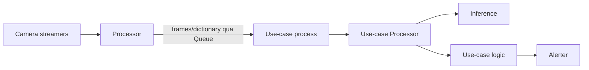
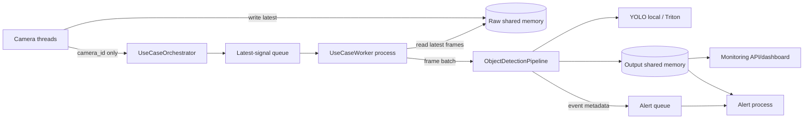

# So sánh tạm thời: `ai-monitoring-dev` và `vision-stream-lab`

> File này chỉ phục vụ việc nghiên cứu và đối chiếu kiến trúc. Có thể xóa sau khi đọc xong.

## 1. Tóm tắt nhanh

Repo mới không phải một hệ thống được viết hoàn toàn khác ý tưởng. Nó giữ lại khung tư duy chính của repo cũ:

- đọc nhiều camera/video;
- cấu hình camera và use case bằng YAML;
- camera chỉ chạy các use case được bật;
- mỗi loại use case có runtime xử lý riêng;
- inference được tách khỏi logic nghiệp vụ của use case;
- kết quả có thể sinh alert;
- hỗ trợ cả model local và Triton.

Điểm khác lớn nhất là implementation đã được thu gọn và tổ chức lại để dễ hiểu, dễ mở rộng và phù hợp mục tiêu phase 1: phát đồng thời nhiều video như nhiều camera, batch inference và hiển thị monitoring gần realtime.

Repo mới hiện chỉ giữ một use case mẫu là `object_detection`. Các use case nghiệp vụ của repo cũ không được mang sang.

## 2. So sánh ở mức kiến trúc

| Chủ đề | Repo cũ: `ai-monitoring-dev` | Repo mới: `vision-stream-lab` |
|---|---|---|
| Entry point | `main.py`, `stream.py` và một số script root | Một composition root rõ ràng: `src/vision_stream_lab/main.py` |
| Camera runtime | `CamerasManager` + `Streamer` | `CameraManager` + `VideoStream` trong package `streaming` |
| Điều phối chính | Class tên chung chung là `Processor` | `UseCaseOrchestrator`, thể hiện đúng trách nhiệm điều phối |
| Runtime use case | Hàm `usecase_worker` tạo process chứa một `...Processor` | Một OS process chứa `UseCaseWorker` và pipeline của use case |
| Số process use case | Về ý tưởng là một process cho mỗi loại use case được bật | Một process cho mỗi deployment/use-case ID; process đó dùng chung cho các camera được route vào nó |
| Truyền frame | Đưa collection/frame qua `multiprocessing.Queue`, phải serialize/pickle | Frame nằm trong shared memory; queue chỉ gửi `camera_id` |
| Queue | `maxsize=100`, có logic rút item cũ, worker dùng `get_nowait()` | Tối đa một pending signal cho mỗi camera/use case; latest-frame semantics |
| Worker chờ việc | Poll bằng `get_nowait()`, dễ thành busy-loop | Blocking `get(timeout=...)`, giảm CPU idle |
| Batch inference | Batch phụ thuộc cách từng processor/use case xử lý collection nhận được | Worker gom frame mới của nhiều camera rồi gọi `process_batch()` đúng một lần |
| Camera routing | Processor giữ mapping nhưng flow tổng quát khó nhìn, có thể tạo/push dữ liệu rộng | Orchestrator lọc camera ngay khi dựng runtime; mỗi worker chỉ nhìn thấy camera đã gán cho use case |
| Alert | Nhiều alerter và logic tracking nằm gần hệ xử lý cũ | Alert/snapshot có process riêng, không encode ảnh trong inference worker |
| Monitoring | OpenTelemetry và logic production liên quan | API + dashboard realtime đơn giản phục vụ lab |
| Inference | Nhiều detect/classify/segment/recognize, local/Triton | Interface tối giản; hiện có YOLO local, YOLO Triton và noop |
| Use case | Nhiều use case production | Chỉ `object_detection`, nhưng giữ registry/base để thêm use case sau |
| Deployment | Có script/deployment và cấu hình production | Cố ý bỏ khỏi scope phase 1 |

## 3. Những gì được giữ lại

### 3.1. Giữ lại tư duy camera là nguồn dữ liệu độc lập

Repo cũ có `CamerasManager` quản lý nhiều `Streamer`. Repo mới vẫn giữ đúng mô hình đó, nhưng đổi tên và đặt đúng package:

```text
Repo cũ                              Repo mới
src/common/manager.py                streaming/manager.py
  CamerasManager                       CameraManager

src/common/streamer.py               streaming/video_stream.py
  Streamer                              VideoStream
```

Mỗi camera vẫn có:

- ID riêng;
- URL hoặc đường dẫn video riêng;
- trạng thái bật/tắt;
- danh sách use case được áp dụng;
- luồng capture độc lập.

Video file có thể loop để giả lập camera chạy liên tục.

### 3.2. Giữ lại cấu hình theo camera và use case

Repo mới vẫn dùng cấu hình thay vì hard-code việc camera nào chạy model nào:

```text
configs/app.yaml
configs/cameras.yaml
configs/deployments.yaml
configs/usecases/object_detection/default.yaml
configs/usecases/object_detection/profiles/road-traffic.yaml
configs/alerts/object_detection.yaml
```

Ý tưởng tương đương repo cũ là:

```text
camera config
    -> bật/tắt use case trên từng camera
    -> use-case config chọn model/backend/threshold
    -> alert config quyết định khi nào xuất event
```

Khác biệt là repo mới chuẩn hóa tên file, tách scope rõ hơn và validate config bằng schema.

### 3.3. Giữ lại ranh giới inference và business logic

Repo cũ đã có package `inference` riêng và code logic riêng trong `usecases`. Repo mới giữ nguyên nguyên tắc này:

```text
inference backend
    -> trả detection thô
use-case analyzer
    -> lọc/diễn giải detection
use-case pipeline
    -> tạo output frame và event
```

Với object detection hiện tại:

- `inference/local/yolo.py`: chạy model YOLO local;
- `inference/triton/yolo.py`: adapter cho Triton;
- `usecases/object_detection/analyzer.py`: lọc detection theo cấu hình;
- `usecases/object_detection/pipeline.py`: ghép inference và logic/output.

Điều này giúp sau này có thể tái sử dụng cùng backend detector cho PPE, intrusion hoặc các use case khác.

### 3.4. Giữ lại process isolation theo loại use case

Repo mới không tạo một worker cho mỗi camera. Nó giữ ý tưởng process riêng cho use case:

```text
Object Detection process
    camera-01 frame ┐
    camera-02 frame ├─> một batch inference
    camera-03 frame ┘
```

Nếu sau này thêm PPE và intrusion:

```text
Main process
├── Object Detection process -> các camera bật object detection
├── PPE process              -> các camera bật PPE
└── Intrusion process        -> các camera bật intrusion
```

Do đó số worker không mặc định tăng tuyến tính theo số camera. Worker của cùng một use case được dùng chung cho nhiều camera.

### 3.5. Giữ lại local inference và Triton

Repo cũ có cả implementation local và Triton. Repo mới vẫn giữ hai hướng này:

- `backend: local`: phù hợp chạy thử nhanh bằng Ultralytics;
- `backend: triton`: dành cho serving tập trung và dynamic batching;
- `backend: noop`: kiểm tra toàn bộ streaming/runtime mà không cần model thật.

## 4. Những gì đã thay đổi

### 4.1. `Processor` được tách thành các trách nhiệm có tên rõ ràng

Trong repo cũ, tên `Processor` có thể chỉ cả tầng điều phối lẫn class xử lý use case. Ví dụ:

```text
Processor
    -> usecase_worker process
        -> PPEProcessor
```

Tên mới mô tả rõ “vật lý” và “logic”:

```text
VisionRuntime
    -> UseCaseOrchestrator
        -> OS process
            -> UseCaseWorker
                -> ObjectDetectionPipeline
                    -> InferenceBackend
                    -> ObjectDetectionAnalyzer
```

Ý nghĩa từng tầng:

- `VisionRuntime`: sở hữu tài nguyên cấp ứng dụng và lifecycle tổng;
- `UseCaseOrchestrator`: tạo process, queue, shared-memory output và route camera;
- OS process: biên cách ly vật lý của multiprocessing;
- `UseCaseWorker`: vòng lặp nhận tín hiệu và gom batch;
- pipeline: workflow của một loại use case;
- analyzer: logic nghiệp vụ sau inference.

### 4.2. Không còn gửi ảnh qua multiprocessing queue

Flow cũ, rút gọn:

```text
Camera/Processor
    -> đóng gói frame hoặc dictionary frame
    -> multiprocessing.Queue(maxsize=100)
    -> pickle/copy giữa process
    -> usecase worker
```

Flow mới:

```text
Camera thread
    -> ghi đè latest frame vào SharedFrameSlot
    -> queue chỉ nhận chuỗi camera_id
    -> worker đọc frame trực tiếp từ shared memory
```

Lợi ích:

- không pickle toàn bộ ảnh cho mỗi lần dispatch;
- queue nhẹ hơn nhiều;
- không tích tụ hàng trăm frame cũ;
- độ trễ không tăng dần khi inference chậm hơn capture;
- cùng một raw frame store có thể phục vụ nhiều use case.

Đây là shared memory, chưa phải GPU zero-copy. Frame vẫn cần được backend/model đưa từ RAM lên GPU khi infer local.

### 4.3. Latest-frame semantics thay cho backlog

Mục tiêu monitoring realtime là xử lý frame mới nhất, không phải xử lý đủ mọi frame đã capture.

Repo mới duy trì tối đa một pending signal cho cặp `(use_case, camera)`:

```text
camera ra frame 101 -> signal pending
camera ra frame 102 -> shared slot bị ghi đè, không thêm signal thứ hai
worker nhận signal  -> đọc frame mới nhất, có thể là frame 102
```

Nếu model không theo kịp camera, hệ thống bỏ qua frame trung gian thay vì tạo latency backlog.

### 4.4. Batch inference được đưa vào runtime chung

Repo cũ có thể truyền một nhóm frame, nhưng batching bị gắn với cách từng processor/use case triển khai và không có một contract thống nhất cho toàn hệ thống.

Repo mới quy định rõ:

```text
UseCaseWorker._next_batch()
    -> chờ camera_id đầu tiên bằng get(timeout)
    -> gom thêm camera_id trong batch_wait_ms
    -> đọc latest frame của từng camera
    -> pipeline.process_batch(frames)
    -> backend.predict_batch(frames)
```

Một lời gọi model có thể chứa frame từ nhiều camera. `batch_size` và `batch_wait_ms` được cấu hình tập trung.

### 4.5. Alert được tách khỏi inference worker

Repo cũ có hệ alerter phong phú hơn, bao gồm default/tracking alerter và nhiều policy theo use case. Tuy nhiên việc xử lý ảnh/alert gần inference có thể làm worker model bị chậm.

Repo mới hiện chỉ có alert tối giản:

```text
Inference worker
    -> tạo event metadata
    -> event queue
Alert process
    -> đọc output frame
    -> encode/lưu snapshot
```

Inference worker không phải chờ JPEG encode hoặc I/O ghi file.

### 4.6. Monitoring đổi mục tiêu

Repo cũ nghiêng về OpenTelemetry/production metrics. Repo mới phục vụ nghiên cứu và benchmark trực quan:

- dashboard nhiều camera;
- endpoint frame JPEG đã annotate;
- capture FPS theo camera;
- inference FPS theo camera/use case;
- batch latency;
- số signal bị drop;
- trạng thái online/offline.

OpenTelemetry chưa được mang sang.

### 4.7. Package layout được tổ chức theo trách nhiệm

Repo cũ có các folder rộng như `common`, `utils`, đồng thời `processors/usecases` và `usecases` dễ gây nhầm hai tầng xử lý.

Repo mới dùng package theo ownership:

```text
streaming/       đọc và quản lý nguồn video
runtime/         multiprocessing, routing, queue, shared memory
inference/       adapter model/serving
usecases/        pipeline và logic nghiệp vụ
alerting/        side effect của alert
monitoring/      API và dashboard
configuration/   đọc/ghép/validate YAML
schema/          data contract
enums/           tập giá trị cố định
```

Không còn folder `common`, `workers`, `utils` chung chung.

## 5. Mapping file và khái niệm cũ sang mới

| Repo cũ | Repo mới | Ghi chú |
|---|---|---|
| `main.py` / `stream.py` | `vision_stream_lab/main.py` | Gom thành một composition root |
| `src/common/manager.py` | `streaming/manager.py` | Quản lý camera |
| `src/common/streamer.py` | `streaming/video_stream.py` | Capture loop cho một nguồn |
| `src/processors/processor.py` | `runtime/orchestrator.py` | Chỉ giữ trách nhiệm điều phối |
| `usecase_worker()` | `runtime/use_case_worker.py` | Worker loop được đặt tên và đóng gói rõ |
| `...Processor` của từng use case | `usecases/<name>/pipeline.py` | Pipeline logic, không đại diện cho OS process |
| `src/inference/base.py` | `inference/base.py` | Contract inference được tối giản và batch-first |
| local YOLO detect | `inference/local/yolo.py` | Một adapter YOLO local gọn hơn |
| Triton detect | `inference/triton/yolo.py` | Giữ đường mở rộng Triton |
| `src/common/alerter/*` | `alerting/snapshot_worker.py` | Hiện chỉ giữ snapshot alert tối giản |
| `src/common/monitoring/otel.py` | `monitoring/api.py` + dashboard | Thay OTEL bằng lab monitoring |
| `src/utils/config_utils.py` | `configuration/loader.py` | Load và validate config có ownership rõ |
| `src/schema/*` | `schema/*` | Giữ ý tưởng schema, viết lại theo config/runtime mới |
| `src/enums/*` | `enums/*` | Giữ enum cần thiết, bỏ enum production chưa dùng |

Mapping này là mapping về trách nhiệm và kiến trúc. Nhiều module mới được viết lại, không phải đổi tên file rồi copy nguyên nội dung.

## 6. Những gì cố ý không mang sang

### 6.1. Các use case production

Repo cũ có nhiều use case như:

- PPE và các biến thể helmet/vest/glove/harness/shoes;
- danger zone và intrusion;
- anti-collision;
- fire and smoke;
- face recognition/emotion;
- illegal parking;
- person laydown;
- speed estimation;
- unmanned bag;
- tracking và nhiều logic theo zone.

Repo mới bỏ toàn bộ implementation này để baseline chỉ còn `object_detection`. Mục tiêu là chứng minh runtime đa camera trước, sau đó thêm use case theo từng module độc lập.

### 6.2. Tracker và model phụ trợ

Chưa mang sang:

- ByteTrack/BOT-SORT;
- face embedding/recognition;
- OCR/PARSeq;
- classify/segment pipeline;
- các model helper chuyên biệt.

Khi cần tracking, nên thêm một component có state theo camera vào pipeline thay vì copy toàn bộ tracker cũ ngay từ đầu.

### 6.3. Spatial rules và production alert policy

Các JSON/TXT spatial rule cũ, Sirren config và alerter theo từng use case chưa được copy. Repo mới giữ `spatial` bên trong config opaque của từng use case: `zones` là lọc sau inference; `tripwires` line crossing và `inference_rois` crop trước inference là các phần mở rộng riêng.

### 6.4. Deployment và integration production

Không mang sang entrypoint shell, deployment fetcher, OTEL stack và các integration ngoài runtime. Đây là chủ ý của phase 1, không phải thiếu sót do restructure.

## 7. Frame flow cũ và mới

### 7.1. Flow cũ, giản lược



Vấn đề chính cho bài toán nhiều camera:

- payload queue lớn do chứa ảnh;
- queue sâu có thể giữ frame cũ;
- polling `get_nowait()`;
- tên `Processor` xuất hiện ở nhiều tầng;
- batching và routing khó quan sát từ kiến trúc tổng.

### 7.2. Flow mới



## 8. Những điểm repo mới đã giải quyết theo yêu cầu ban đầu

- [x] Giữ cấu trúc mở rộng theo use case.
- [x] Hiện chỉ có object detection.
- [x] Nhiều camera dùng chung worker của cùng use case.
- [x] Batch infer nhiều camera.
- [x] Queue theo latest frame, không dùng backlog 100 frame.
- [x] Main/orchestrator lọc camera trước khi gửi use case.
- [x] Shared memory thay cho pickle ảnh qua queue.
- [x] Alert encode/snapshot tách khỏi inference worker.
- [x] Worker dùng `get(timeout=...)` thay cho busy-loop.
- [x] Có backend Triton để tận dụng dynamic batching phía server.
- [x] Có shard index/count để chia camera qua nhiều instance/GPU.
- [x] Có monitoring nhiều camera và FPS/latency.
- [x] Tên tầng runtime không còn lẫn lộn với processor logic.

## 9. Những giới hạn hiện tại của repo mới

Repo mới là baseline nghiên cứu, chưa phải bản thay thế đầy đủ cho production repo cũ:

- local YOLO vẫn copy frame từ CPU RAM lên GPU;
- shared memory hiện là fixed-size BGR frame slot;
- output dashboard dùng JPEG nên vẫn tốn CPU encode;
- một use-case process local chỉ sử dụng một model instance;
- chưa có reconnect policy nâng cao cho camera mạng;
- chưa có tracker, zone engine, debounce/cooldown phức tạp;
- chưa có OTEL, persistence, message broker hoặc alert integration ngoài snapshot;
- Triton adapter là đường tích hợp, cần khớp tensor/model repository thực tế khi triển khai;
- chưa benchmark tải cực lớn hoặc multi-GPU production.

## 10. Kết luận

Có thể xem quan hệ giữa hai repo như sau:

```text
ai-monitoring-dev
    = nhiều business use case + nhiều integration production
      + runtime cũ khó hiểu và chưa tối ưu tốt cho nhiều camera

vision-stream-lab
    = giữ khung camera -> route use case -> inference -> logic -> alert
      + viết lại runtime theo shared-memory/latest-frame/batched inference
      + tổ chức module rõ trách nhiệm
      + chỉ giữ object detection làm use case mẫu
```

Repo mới phù hợp làm nền để đo hiệu năng, sửa runtime và thêm lại từng use case có chọn lọc. Không nên copy toàn bộ use case cũ vào một lần; nên đưa từng use case sang sau khi xác định rõ inference dependency, state theo camera, zone/tracker và alert contract của nó.
