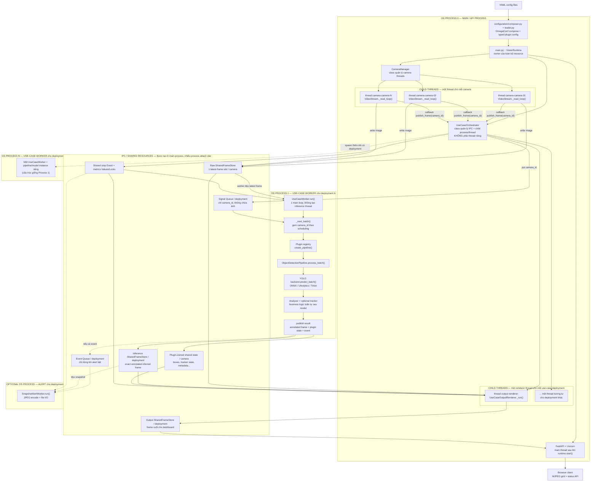
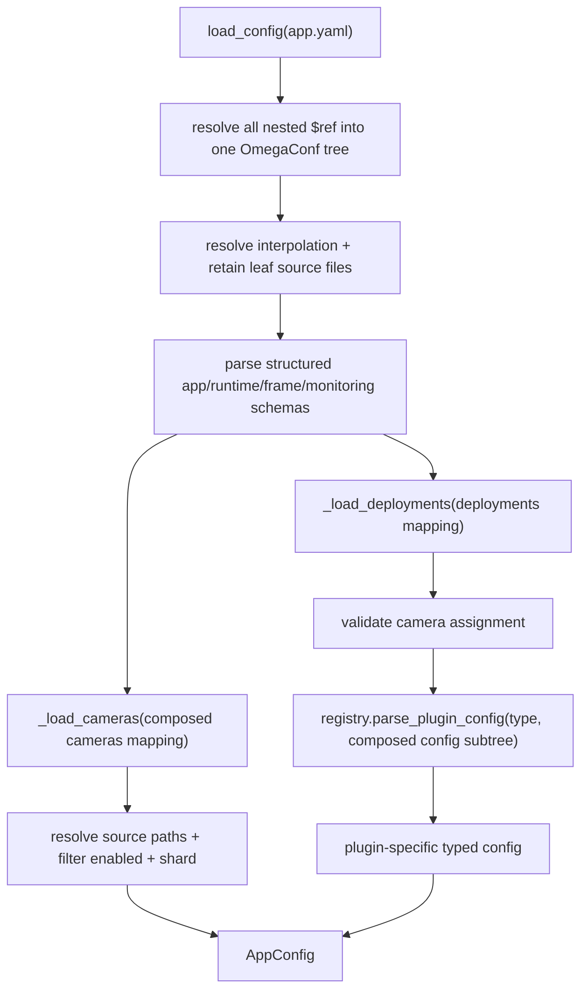
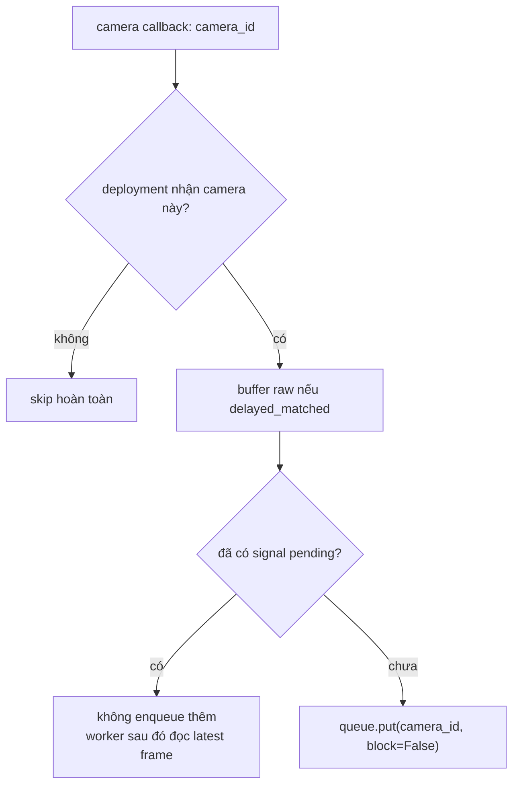
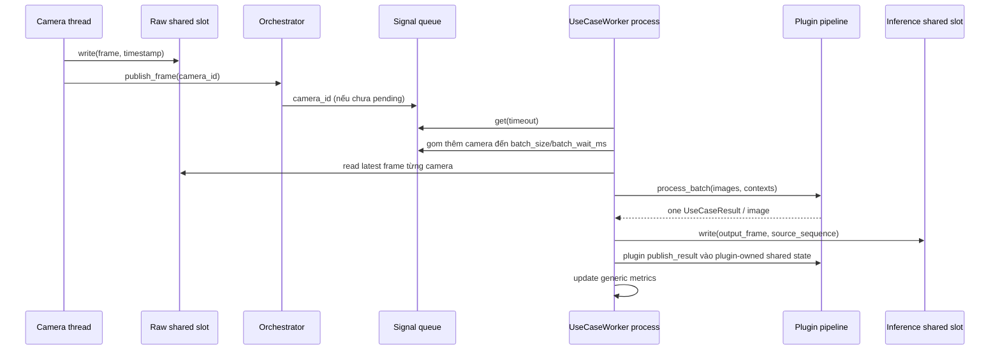

# Hướng dẫn đọc hiểu source Vision Stream Lab

> File tạm phục vụ việc nghiên cứu source. Có thể xóa sau khi đã quen kiến trúc.

## 1. Mục tiêu của tài liệu

Tài liệu này trả lời bốn câu hỏi:

1. Nên đọc file nào trước, file nào sau để hiểu toàn bộ runtime?
2. Một frame đi từ camera đến model, business logic và dashboard như thế nào?
3. Process, thread, queue và shared memory nằm ở đâu?
4. Khi thêm hoặc sửa một use case thì cần đụng vào những file nào?

Không nên bắt đầu bằng implementation YOLO. Nếu đọc model trước, ta sẽ hiểu được inference nhưng chưa thấy ai tạo model, batch được gom ở đâu, camera nào được route vào use case nào và kết quả được đồng bộ với frame ra sao.

---

## 2. Bức tranh tổng thể



### Cách đọc các đường biên trong hình

- Mỗi khối lớn có tiêu đề `OS PROCESS ...` là một process vật lý, có PID và
  Python interpreter riêng.
- `PROCESS 0` luôn có đúng một. Mỗi use-case **deployment ID** tạo thêm một
  use-case worker process; không phải mỗi camera tạo một process.
- `CameraManager`, `UseCaseOrchestrator` và `VisionRuntime` chỉ là object/class
  trong main process. Đặc biệt, orchestrator không tự có vòng lặp hay thread
  riêng: callback `publish_frame()` chạy ngay trên camera thread vừa đọc frame.
- Mỗi camera có một `VideoStream` thread. Mỗi use-case deployment có một
  `UseCaseOutputRenderer` thread, cũng nằm trong main process.
- Trong use-case worker, `UseCaseWorker → Pipeline → Model → Analyzer/Tracker`
  là chuỗi gọi hàm tuần tự trên main thread của child process. Hiện không có
  “model process” hoặc “inference thread” thứ hai ẩn bên trong.
- Alert process chỉ được spawn khi `alert.enabled: true`; JPEG encode và ghi đĩa
  vì vậy không chặn inference worker.
- Các block trong `IPC / SHARED RESOURCES` không phải service/process. Chúng là
  queue, event, lock/value và vùng shared memory do main process tạo rồi truyền
  handle cho child process attach vào.

### Đếm resource theo công thức

Với `C` camera, `U` use-case deployment đang bật và `A` deployment bật alert:

| Resource | Số lượng |
|---|---:|
| Main/API process | `1` |
| Camera thread | `C` |
| Use-case worker process | `U` |
| Output renderer thread | `U` |
| Alert process | `A` |
| Tổng OS process | `1 + U + A` |

Ví dụ hiện tại `C=3`, `U=1`, alert tắt (`A=0`) thì có **2 process** và các
thread nghiệp vụ chính là **3 camera threads + 1 renderer thread**; Uvicorn chạy
trên main thread. Nếu tách object detection thành ba deployment ID thì `U=3`:
có ba worker process, ba renderer thread và ba model instance riêng.

Điểm cần nhớ:

- `CameraManager` không chạy model. Nó chỉ quản lý các luồng đọc camera/video.
- `UseCaseOrchestrator` không làm inference. Nó tạo tài nguyên, route tín hiệu và quản lý vòng đời process/thread.
- `UseCaseWorker` là process vật lý thực thi một use case. Model và business pipeline hiện cùng nằm trong process này và chạy tuần tự.
- Queue không chứa ảnh. Queue chỉ chứa `camera_id`; ảnh thật nằm trong shared memory.
- Core không biết state là boxes, velocity, OCR text hay keypoints. Plugin tự tạo, ghi, đọc và render shared state của nó.
- Mỗi camera chỉ giữ latest raw frame trong shared memory. Nếu model không theo kịp thì frame cũ bị bỏ qua có chủ đích.
- Renderer chạy độc lập với inference để output vẫn đạt `monitoring.stream_fps`.

---

## 3. Thứ tự đọc đề xuất — vòng 1: nắm end-to-end

Vòng đầu chỉ cần hiểu trách nhiệm và các điểm nối. Chưa cần đọc chi tiết thuật toán ONNX, tracker hay JavaScript.

### Bước 1 — Đọc config chạy thật

Đọc theo thứ tự:

1. [`configs/app.yaml`](configs/app.yaml)
2. [`configs/cameras.yaml`](configs/cameras.yaml)
3. [`configs/deployments.yaml`](configs/deployments.yaml)
4. [`configs/usecases/object_detection.yaml`](configs/usecases/object_detection.yaml)
5. [`configs/inference/detection/yolo/yolo11n_onnx.yaml`](configs/inference/detection/yolo/yolo11n_onnx.yaml)
6. [`configs/alerts/object_detection.yaml`](configs/alerts/object_detection.yaml)

Cần trả lời được:

- Batch tối đa bao nhiêu camera?
- Worker chờ thêm frame để ghép batch bao lâu?
- Output target FPS là bao nhiêu và đang dùng render mode nào?
- Có những camera nào, nguồn ở đâu, camera nào loop, camera nào bị giới hạn FPS?
- Deployment `object-detection` nhận tất cả camera hay chỉ một tập camera?
- Backend model là ONNX, local Ultralytics, Triton hay noop?
- Confidence, IoU và class filter thuộc use case nào?

Ba tầng config khác nhau:

```text
app.yaml
├── runtime/frame/monitoring       cấu hình dùng chung toàn app
├── cameras: $ref cameras.yaml
└── deployments: $ref deployments.yaml
    ├── config: $ref usecases/*.yaml
    │   └── inference: $ref inference/<objective>/*.yaml
    └── alert: $ref alerts/*.yaml
```

Use-case config có thể dùng `$ref` để tái sử dụng inference preset. Thứ tự thực
tế là resolve `$ref` đệ quy → deep-merge field local → resolve `${...}` → plugin
parse thành typed config. Worker mặc định nằm ở `app.runtime.worker_defaults`;
mỗi entry trong `deployments.yaml` chỉ khai báo `runtime` khi thật sự cần override.

### Bước 2 — Đọc schema để biết “hình dạng dữ liệu”

Đọc:

1. [`src/vision_stream_lab/schema/config.py`](src/vision_stream_lab/schema/config.py)
2. [`src/vision_stream_lab/schema/camera.py`](src/vision_stream_lab/schema/camera.py)
3. [`src/vision_stream_lab/schema/use_case.py`](src/vision_stream_lab/schema/use_case.py)
4. [`src/vision_stream_lab/schema/frame.py`](src/vision_stream_lab/schema/frame.py)

Detector config/contracts không thuộc generic schema. Khi cần đọc YOLO backend,
đọc thêm [`inference/detection/schema.py`](src/vision_stream_lab/inference/detection/schema.py),
[`inference/detection/registry.py`](src/vision_stream_lab/inference/detection/registry.py)
và [`inference/detection/yolo/config.py`](src/vision_stream_lab/inference/detection/yolo/config.py).

Các type quan trọng:

| Type | Ý nghĩa |
|---|---|
| `AppConfig` | Config đã load và validate xong của toàn app |
| `UseCaseDeploymentConfig` | Một deployment: `id`, `type`, config plugin, camera assignment, alert |
| `FrameContext` | Danh tính frame đưa vào pipeline: camera, sequence, timestamp |
| `UseCaseResult` | Kết quả pipeline: output frame, event count, metadata |
| `SharedFrameHandle` | Thông tin để process khác attach vào vùng shared memory |
| `CameraState` | Metric capture dùng chung giữa runtime và API |
| `UseCaseCameraState` | Metric generic và một `plugin_state: Any` opaque theo camera/use case |

Phân biệt hai loại config:

- `UseCaseDeploymentConfig` là vỏ chung để runtime quản lý mọi plugin.
- `ObjectDetectionConfig` là config riêng của plugin object detection, không nên đẩy field riêng của YOLO/tracker vào schema deployment chung.

### Bước 3 — Đọc config loader

Đọc [`src/vision_stream_lab/configuration/composer.py`](src/vision_stream_lab/configuration/composer.py)
trước, rồi đọc [`src/vision_stream_lab/configuration/loader.py`](src/vision_stream_lab/configuration/loader.py).

Theo dấu `load_config()`:



Chú ý:

- Path video/model tương đối được hiểu từ project root.
- Camera bị `enabled: false` không đi vào runtime.
- Sharding lọc camera trước khi tạo worker.
- Use case không có camera nào trong shard hiện tại cũng bị bỏ qua.
- Loader không biết field chi tiết của object detection; nó giao phần đó cho plugin registry.

### Bước 4 — Đọc entrypoint và vòng đời app

Đọc [`src/vision_stream_lab/main.py`](src/vision_stream_lab/main.py).

Tập trung vào `VisionRuntime.__init__()`:

1. Tạo multiprocessing context bằng `spawn`.
2. Tạo metric state cho camera.
3. Tạo raw shared-frame store.
4. Tạo `UseCaseOrchestrator`.
5. Tạo `CameraManager` và nối callback `on_frame` vào `UseCaseOrchestrator.publish_frame`.

Sau đó:

- `VisionRuntime.start()` khởi động use-case worker trước, camera sau.
- `create_app(...)` nhận các shared store/state để dashboard đọc.
- `uvicorn.run(...)` giữ main process sống.
- `finally: runtime.close()` dừng camera, worker, renderer và unlink shared memory.

Đây là composition root: file trả lời câu hỏi “ai tạo ai”.

### Bước 5 — Đọc đường capture camera

Đọc:

1. [`src/vision_stream_lab/streaming/manager.py`](src/vision_stream_lab/streaming/manager.py)
2. [`src/vision_stream_lab/streaming/video_stream.py`](src/vision_stream_lab/streaming/video_stream.py)
3. [`src/vision_stream_lab/streaming/camera_simulator.py`](src/vision_stream_lab/streaming/camera_simulator.py)

Flow một camera:

```text
CameraManager
└── VideoStream(camera-X)
    └── thread _read_loop()
        ├── cv2.VideoCapture(source)
        ├── xử lý native FPS / timeline / loop / sampling
        ├── resize về frame.width × frame.height
        ├── raw SharedFrameSlot.write(frame, timestamp)
        ├── cập nhật CameraState
        └── on_frame(camera_id)
```

`camera_simulator.py` chỉ chuyển danh sách file video từ CLI thành các `CameraDefinition`. Sau bước đó, video giả lập đi chung hoàn toàn flow với camera config bình thường.

### Bước 6 — Đọc shared memory trước khi đọc worker

Đọc [`src/vision_stream_lab/runtime/shared_frames.py`](src/vision_stream_lab/runtime/shared_frames.py), đối chiếu với [`schema/frame.py`](src/vision_stream_lab/schema/frame.py).

Cần hiểu:

- `SharedFrameSlot`: một vùng ảnh cố định cho một camera; có sequence, timestamp và lock.
- `SharedFrameStore`: map `camera_id -> SharedFrameSlot`.
- `create(...)`: main process cấp phát shared memory.
- Constructor từ handles: child process attach vào vùng đã có, không cấp ảnh mới.
- `write(...)`: copy frame vào shared memory và tăng sequence output.
- `source_sequence`: cho biết output inference bắt nguồn từ raw frame sequence nào.
- `read_if_new(...)`: tránh copy lại cùng một frame khi sequence không đổi.
- `create_use_case_states(...)` chỉ gắn opaque `plugin_state` đã do registry/plugin tạo; core shared-frame module không biết layout của state đó.

Riêng object detection định nghĩa boxes/velocity shared state trong
[`usecases/object_detection/state.py`](src/vision_stream_lab/usecases/object_detection/state.py).
Plugin OCR hoặc pose sau này có thể định nghĩa layout khác mà không sửa file core này.

Shared memory ở đây tránh việc pickle nguyên ảnh qua `multiprocessing.Queue`. Tuy nhiên đọc/ghi shared slot vẫn có copy NumPy dưới lock; “shared memory” không đồng nghĩa tuyệt đối zero-copy ở mọi bước.

### Bước 7 — Đọc orchestrator: routing và process topology

Đọc [`src/vision_stream_lab/runtime/orchestrator.py`](src/vision_stream_lab/runtime/orchestrator.py).

`UseCaseOrchestrator.__init__()` làm các việc sau cho mỗi deployment:

1. Lọc đúng camera bằng `use_case.accepts_camera(camera_id)`.
2. Tạo inference store riêng cho use case.
3. Tạo final output store riêng cho use case.
4. Gọi plugin hook để tạo shared state riêng theo camera, rồi gắn nó vào metric state generic.
5. Tạo signal queue, event queue.
6. Tạo `UseCaseOutputRenderer`.

`start()` tạo:

- Một OS process `use-case-<id>` chạy `run_use_case_worker`.
- Một renderer thread trong main process.
- Nếu alert bật, thêm một alert OS process riêng.

`publish_frame(camera_id)` là điểm route chính:



Queue có kích thước theo số camera và mỗi camera tối đa một pending signal. Đây là cơ chế latest-frame/backpressure: model chậm thì không tích 100 frame cũ để xử lý trễ dần.

### Bước 8 — Đọc use-case worker: batch và execution boundary

Đọc [`src/vision_stream_lab/runtime/use_case_worker.py`](src/vision_stream_lab/runtime/use_case_worker.py).

Đây là file quan trọng nhất để hiểu runtime inference.



Các invariants nên nhớ:

- Một batch không chứa trùng camera.
- `images[i]`, `contexts[i]`, `results[i]` phải cùng camera/frame.
- Pipeline phải trả đúng một result cho mỗi input image.
- `sequence` đọc cùng raw frame phải được giữ đến lúc ghi output để renderer match đúng frame.
- Model và analyzer hiện chạy tuần tự trong cùng worker process, không có “model process” thứ hai.
- Các deployment use case khác nhau mới chạy song song bằng các process khác nhau.

### Bước 9 — Đọc plugin contract và registry

Đọc:

1. [`src/vision_stream_lab/usecases/base.py`](src/vision_stream_lab/usecases/base.py)
2. [`src/vision_stream_lab/usecases/plugin.py`](src/vision_stream_lab/usecases/plugin.py)
3. [`src/vision_stream_lab/usecases/registry.py`](src/vision_stream_lab/usecases/registry.py)

`UseCasePipeline` định nghĩa runtime contract `process_batch()`.

Một `UseCasePlugin` đăng ký năm hook:

| Hook | Chạy ở đâu | Vai trò |
|---|---|---|
| `parse_config` | Main process lúc startup | Parse/validate YAML riêng thành typed config |
| `create_pipeline` | Use-case worker process | Tạo model và business pipeline |
| `create_shared_state` | Main process lúc startup | Cấp phát multiprocessing state riêng của plugin/camera |
| `publish_result` | Use-case worker process | Chuyển `UseCaseResult` vào shared state riêng |
| `render_latest` | Renderer thread trong main process | Đọc state riêng, áp dụng TTL và vẽ lên raw frame |

Registry là điểm duy nhất runtime cần biết danh sách loại use case. Lazy import giúp main process không import model/backend nặng trước khi spawn worker.

### Bước 10 — Đọc object detection plugin từ ngoài vào trong

Đọc đúng thứ tự:

1. [`usecases/object_detection/plugin.py`](src/vision_stream_lab/usecases/object_detection/plugin.py)
2. [`usecases/object_detection/config.py`](src/vision_stream_lab/usecases/object_detection/config.py)
3. [`usecases/object_detection/pipeline.py`](src/vision_stream_lab/usecases/object_detection/pipeline.py)
4. [`usecases/object_detection/state.py`](src/vision_stream_lab/usecases/object_detection/state.py)
5. [`usecases/object_detection/analyzer.py`](src/vision_stream_lab/usecases/object_detection/analyzer.py)
6. [`usecases/object_detection/rendering.py`](src/vision_stream_lab/usecases/object_detection/rendering.py)
7. [`usecases/object_detection/tracker.py`](src/vision_stream_lab/usecases/object_detection/tracker.py) — chỉ cần đọc nếu bật tracker

Flow bên trong pipeline:

```text
ObjectDetectionPipeline.process_batch(images, contexts)
├── detector.predict_batch(images)        true batch inference
├── for từng prediction + context
│   ├── optional tracker.update(...)
│   ├── analyzer.analyze(image, detector_boxes)
│   └── metadata
│       ├── detections = tracked/latest boxes
│       └── velocities = motion estimate
└── list[UseCaseResult]
```

Một chi tiết quan trọng: `output_frame` được vẽ bằng detector boxes của đúng frame inference để bảo toàn pixel alignment. Tracker output nằm trong metadata và object-detection-owned state, chỉ phục vụ projection ở latest-predictions mode.

### Bước 11 — Đọc inference abstraction rồi mới đọc ONNX

Đọc:

1. [`src/vision_stream_lab/inference/core/base.py`](src/vision_stream_lab/inference/core/base.py)
2. [`src/vision_stream_lab/inference/detection/base.py`](src/vision_stream_lab/inference/detection/base.py)
3. [`src/vision_stream_lab/inference/detection/registry.py`](src/vision_stream_lab/inference/detection/registry.py)
4. [`src/vision_stream_lab/inference/detection/yolo/plugin.py`](src/vision_stream_lab/inference/detection/yolo/plugin.py)
5. Backend đang dùng: [`inference/detection/yolo/onnx.py`](src/vision_stream_lab/inference/detection/yolo/onnx.py)
6. Pre/postprocess: [`preprocessing.py`](src/vision_stream_lab/inference/detection/yolo/preprocessing.py) và [`postprocessing.py`](src/vision_stream_lab/inference/detection/yolo/postprocessing.py)
7. Khi cần mới đọc adapter [`ultralytics.py`](src/vision_stream_lab/inference/detection/yolo/ultralytics.py) hoặc [`triton.py`](src/vision_stream_lab/inference/detection/yolo/triton.py)

Contract backend rất nhỏ:

```python
predict_batch(inputs: Sequence[InputT]) -> tuple[OutputT, ...]
```

ONNX file nên chia ra đọc theo ba khối:

1. `preprocess_images`: letterbox, BGR→RGB, normalize, HWC→BCHW, ghép batch.
2. `session.run`: gọi ONNX Runtime một lần cho batch động; nếu model fixed batch 1 thì fallback chạy từng ảnh.
3. `postprocess_yolo_output`: decode output, confidence filter, class filter, NMS, scale box về ảnh gốc.

Nếu muốn tối ưu FPS, đây là nơi kiểm tra provider, dynamic batch, image size, thread options và thời gian preprocess/postprocess. Không nên nhét logic cảnh báo/domain vào backend model.

### Bước 12 — Đọc output renderer và ba mode hiển thị

Đọc:

1. [`src/vision_stream_lab/enums/rendering.py`](src/vision_stream_lab/enums/rendering.py)
2. [`src/vision_stream_lab/runtime/output_renderer.py`](src/vision_stream_lab/runtime/output_renderer.py)
3. State + hook render của plugin: [`usecases/object_detection/state.py`](src/vision_stream_lab/usecases/object_detection/state.py) và [`rendering.py`](src/vision_stream_lab/usecases/object_detection/rendering.py)

| Mode | Frame hiển thị | Prediction | Delay chủ động |
|---|---|---|---|
| `delayed_matched` | Raw frame tại timeline đã delay | Chỉ dùng annotated inference có cùng source sequence; nếu không có thì raw | Có, `alignment_delay_ms` |
| `inference_only` | Exact annotated inference frame mới nhất, có thể lặp lại để đủ output FPS | Luôn pixel-aligned vì image và box sinh cùng lần infer | Không thêm delay buffer |
| `latest_predictions` | Raw frame mới nhất | Vẽ snapshot prediction mới nhất còn TTL; tracker có thể project nếu bật | Không thêm delay buffer |

Renderer ghi kết quả cuối vào `output_store` đều theo `stream_fps`, độc lập tốc độ model. Vì vậy cần phân biệt:

- `capture_fps`: tốc độ lấy frame nguồn.
- `inference_fps`: mỗi camera được model xử lý bao nhiêu frame/giây.
- `output_fps`: renderer tạo output bao nhiêu lần/giây.
- FPS MJPEG: tốc độ HTTP encode/transmit, có thể lặp latest output frame.

### Bước 13 — Đọc monitoring cuối cùng

Đọc:

1. [`src/vision_stream_lab/monitoring/api.py`](src/vision_stream_lab/monitoring/api.py)
2. [`src/vision_stream_lab/monitoring/frontend/index.html`](src/vision_stream_lab/monitoring/frontend/index.html)
3. [`src/vision_stream_lab/monitoring/frontend/app.js`](src/vision_stream_lab/monitoring/frontend/app.js)
4. [`src/vision_stream_lab/monitoring/frontend/styles.css`](src/vision_stream_lab/monitoring/frontend/styles.css)

API không chạy model và không tự align frame. Nó chỉ:

- đọc status từ shared state,
- đọc output store đã render,
- JPEG encode,
- stream MJPEG theo target FPS,
- serve dashboard tĩnh.

Nếu dashboard bbox sai alignment, hãy kiểm tra worker/renderer trước API. Nếu dashboard giật nhưng output store đúng, mới kiểm tra JPEG/MJPEG/browser.

---

## 4. Thứ tự đọc đề xuất — vòng 2: trace một frame bằng biến thật

Ở vòng này, dùng một camera và theo đúng năm giá trị:

```text
camera_id
raw sequence
raw timestamp
source_sequence của inference
output sequence
```

Trace theo các điểm:

1. `VideoStream._read_loop()` ghi raw frame.
2. `SharedFrameSlot.write()` tăng raw sequence.
3. `UseCaseOrchestrator.publish_frame()` enqueue `camera_id`.
4. `UseCaseWorker._next_batch()` lấy danh sách camera.
5. `raw_store.slots[camera_id].read()` lấy image + sequence + timestamp cùng nhau.
6. `FrameContext(...)` mang identity vào pipeline.
7. `pipeline.process_batch()` giữ đúng thứ tự input/output.
8. Worker ghi inference frame với `source_sequence=raw sequence`.
9. Worker gọi plugin `publish_result`; object detection tự ghi boxes/velocity/sequence/timestamp vào state của nó.
10. Renderer chọn raw/inference/plugin state tùy mode và ghi final output.
11. FastAPI đọc final output rồi encode MJPEG.

Nếu phát sinh bbox “bóng ma”, nháy hoặc lệch object, trace năm giá trị trên trước khi sửa tracker.

---

## 5. Process và thread map

Với ba camera và một use case object detection, alert tắt:

```text
Main OS process
├── main thread: Uvicorn / FastAPI
├── camera-camera-01 thread: đọc camera 01
├── camera-camera-02 thread: đọc camera 02
├── camera-camera-03 thread: đọc camera 03
└── output-renderer-object-detection thread

Child OS process: use-case-object-detection
└── một execution loop tuần tự
    ├── gom batch camera IDs
    ├── đọc shared frames
    ├── model inference
    ├── analyzer / optional tracker
    ├── ghi inference output + gọi plugin publish_result
    └── phát event nếu cần
```

Nếu bật alert sẽ có thêm `alert-object-detection` process. Nếu thêm deployment use case thứ hai sẽ có thêm một use-case process và một renderer thread riêng.

Hiện không tồn tại:

- một worker process cho từng camera,
- một model process riêng nằm sau use-case process,
- một queue chứa toàn bộ frame image,
- nhiều thread chạy analyzer song song với model trong cùng use-case process.

---

## 6. Ba loại “output” dễ nhầm

| Nơi lưu | Producer | Nội dung | Consumer |
|---|---|---|---|
| `raw_store` | Camera threads | Latest resized raw frame/camera | Worker + renderer |
| `inference_store` | UseCaseWorker | Annotated image của exact inferred frame | Renderer + alert |
| `output_store` | UseCaseOutputRenderer | Frame cuối theo render mode và output FPS | FastAPI/MJPEG |

`plugin_state` là state phụ song song với ba store trên. Với object detection, state này chứa boxes/velocity nhỏ gọn để renderer vẽ lên latest raw frame. Layout và reader/writer đều nằm trong package plugin; runtime chỉ giữ reference opaque.

---

## 7. Khi sửa logic object detection hiện tại

### Đổi threshold, class filter, backend hoặc model

Sửa [`configs/usecases/object_detection.yaml`](configs/usecases/object_detection.yaml).

Nếu thêm field config mới:

1. Thêm field vào `ObjectDetectionConfig` hoặc config con.
2. Parse và validate trong `parse_object_detection_config()`.
3. Dùng field tại pipeline/backend/render hook thích hợp.
4. Thêm test config invalid/valid.

### Đổi business logic sau detection

Thông thường sửa:

- `object_detection/analyzer.py`: rule/domain analysis và annotated exact inference frame.
- `object_detection/pipeline.py`: orchestration detector → tracker → analyzer → result metadata/event.

Không sửa `UseCaseWorker` nếu logic chỉ riêng object detection. Worker phải tiếp tục generic cho mọi plugin.

### Đổi thuật toán render box latest/tracker

Sửa:

- `object_detection/rendering.py`
- `object_detection/tracker.py`
- `ObjectDetectionConfig.TrackerConfig`

Không biến tracker thành global runtime config vì plugin khác có thể không cần tracker hoặc cần tracker hoàn toàn khác.

### Đổi batch/backpressure

Đọc và test đồng thời:

- `runtime/use_case_worker.py`
- `runtime/orchestrator.py`
- `runtime/shared_frames.py`
- `tests/test_orchestration.py`
- `tests/test_shared_frames.py`

Đây là thay đổi hạ tầng, có thể ảnh hưởng mọi use case.

---

## 8. Checklist thêm một use case mới

Ví dụ thêm `intrusion_detection`.

### 8.1. Tạo package plugin

```text
src/vision_stream_lab/usecases/intrusion_detection/
├── __init__.py
├── config.py
├── plugin.py
├── pipeline.py
├── state.py           shared-state schema + create/publish/read
├── analyzer.py        tùy nhu cầu
├── rendering.py       nếu latest_predictions cần custom drawing
└── tracker.py          chỉ khi use case này thật sự cần
```

### 8.2. Định nghĩa typed config riêng

Trong `config.py`:

- tạo dataclass config,
- parse mapping YAML,
- từ chối field lạ,
- validate range/path/combination,
- không làm side effect và không load model tại bước parse.

### 8.3. Implement pipeline contract

Trong `pipeline.py`:

```python
class IntrusionDetectionPipeline(UseCasePipeline):
    def process_batch(self, images, contexts=None) -> list[UseCaseResult]:
        ...
```

Bắt buộc:

- nhận batch ảnh,
- giữ đúng thứ tự,
- trả một result trên một input,
- dùng `FrameContext.camera_id/sequence/timestamp` cho state per-camera,
- không lưu chung temporal state giữa các camera,
- không tự tạo process/thread nếu chưa có lý do đo đạc rõ ràng.

### 8.4. Implement plugin hooks

Trong `plugin.py`, tạo `PLUGIN = UseCasePlugin(...)` gồm:

- `type`,
- `parse_config`,
- `create_pipeline`,
- `create_shared_state`,
- `publish_result`,
- `render_latest`.

Mỗi plugin tự sở hữu kiểu state: object detection dùng boxes/velocity, OCR có thể dùng text/regions, pose dùng keypoints. Nếu use case không hỗ trợ `latest_predictions`, state có thể rỗng và `render_latest` trả raw; không dùng state/renderer của object detection.

### 8.5. Để registry tự discover type

Không sửa enum hoặc registry. Folder phải là lowercase snake_case, ví dụ
`usecases/intrusion_detection/`; file `plugin.py` export `PLUGIN` với
`type="intrusion_detection"`. YAML `type` phải trùng hai giá trị này.

Registry tự import `usecases/<type>/plugin.py` và kiểm tra descriptor lúc startup.

### 8.6. Thêm config deployment

Tạo:

```text
configs/usecases/intrusion_detection.yaml
configs/alerts/intrusion_detection.yaml
```

Sau đó thêm entry vào `configs/deployments.yaml`:

```yaml
intrusion-main:
  type: intrusion_detection
  enabled: true
  cameras: [camera-01, camera-03]
  config:
    $ref: usecases/intrusion_detection.yaml
  alert:
    $ref: alerts/intrusion_detection.yaml
```

Mapping key là deployment ID; `type` là plugin type. Có thể có nhiều deployment cùng type nhưng dùng config/camera assignment khác nhau. Mỗi deployment hiện tạo một process riêng và load model riêng.

### 8.7. Thêm test theo lớp

Tối thiểu nên có:

1. Test parse/validation plugin config.
2. Test pipeline trả đúng số result và giữ đúng camera order.
3. Test camera assignment: camera không được gán không nhận signal.
4. Test rendering hook với empty prediction và prediction hợp lệ.
5. Test registry tạo đúng plugin/pipeline.
6. Smoke test với backend noop/fake trước khi dùng model thật.

---

## 9. File nào không nên sửa cho một feature riêng của use case

Nếu feature chỉ thuộc object detection, ưu tiên không sửa:

- `main.py`
- `runtime/orchestrator.py`
- `runtime/use_case_worker.py`
- `runtime/shared_frames.py`
- `monitoring/api.py`
- schema deployment chung

Chỉ sửa core khi contract chung thật sự thiếu khả năng mà từ hai use case trở lên có thể dùng. Nếu một plugin cần metadata mới, trước hết giữ metadata đó trong `UseCaseResult.metadata` và giải quyết trong hook/plugin của nó.

---

## 10. Tests nên đọc kèm source

| Muốn hiểu | Đọc test |
|---|---|
| Config composition/plugin config | `tests/test_config.py`, `tests/test_use_cases.py` |
| Camera lifecycle/video FPS | `tests/test_camera_manager.py` |
| Shared memory/sequence/snapshot | `tests/test_shared_frames.py` |
| Queue routing/batching | `tests/test_orchestration.py` |
| Render modes/alignment | `tests/test_output_renderer.py` |
| ONNX preprocessing/postprocessing | `tests/test_inference.py` |
| Tracker | `tests/test_tracker.py` |
| API/status/MJPEG | `tests/test_monitoring.py` |

Tests thường là cách nhanh nhất để thấy invariant mà implementation phải giữ.

---

## 11. Lộ trình đọc rút gọn theo thời gian

### Có 30 phút

```text
configs/*.yaml
→ main.py
→ runtime/orchestrator.py
→ runtime/use_case_worker.py
→ usecases/registry.py
→ usecases/object_detection/pipeline.py
→ runtime/output_renderer.py
```

### Có 2 giờ

Đọc toàn bộ vòng 1 đến bước 13, nhưng bỏ qua chi tiết toán trong ONNX NMS và Kalman tracker.

### Muốn bắt đầu code use case mới ngay

```text
schema/use_case.py
→ usecases/base.py
→ usecases/plugin.py
→ usecases/registry.py
→ usecases/object_detection/{config,plugin,pipeline,rendering}.py
→ runtime/use_case_worker.py
→ configs/deployments.yaml
→ tests/test_use_cases.py
```

### Muốn tối ưu hiệu năng

```text
streaming/video_stream.py
→ runtime/shared_frames.py
→ runtime/orchestrator.py
→ runtime/use_case_worker.py
→ inference/detection/yolo/onnx.py
→ runtime/output_renderer.py
→ monitoring/api.py
```

Đo riêng capture, batch wait, preprocess, model, postprocess, render và JPEG encode trước khi thay đổi kiến trúc.

---

## 12. Mental model cuối cùng

Có thể ghi nhớ source bằng một câu:

> Camera threads liên tục ghi latest raw frame vào shared memory; orchestrator chỉ gửi camera ID đến đúng use-case process; worker gom camera thành true batch rồi chạy model và business logic tuần tự; plugin tự publish shared result state; renderer kết hợp raw/inference/plugin state thành output ổn định theo mode; FastAPI chỉ đọc output để phục vụ dashboard.

Và khi thêm use case:

> Tạo typed config + pipeline + shared-state/render hooks trong package plugin, để registry tự discover theo folder/type, rồi khai báo deployment/camera assignment trong YAML; chỉ sửa runtime core nếu contract chung thật sự cần thay đổi.
