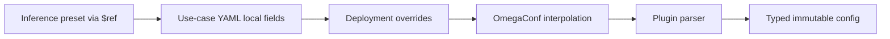

# Configuration architecture

The project uses OmegaConf as a small composition layer. It deliberately does
not use Hydra: process startup, CLI parsing, run directories, and experiment
sweeps remain ordinary application code.

## Responsibilities

| Layer | Owns | Does not own |
|---|---|---|
| `configs/app.yaml` | App runtime defaults, frame shape, monitoring, config-file locations | Model-specific fields |
| `configs/cameras.yaml` | Sources and capture behavior | Use-case routing |
| `configs/use_cases.yaml` | Deployments, camera assignment, runtime override, algorithm override | Plugin schema |
| `configs/usecases/*.yaml` | One plugin's algorithm composition | Worker lifecycle |
| `configs/inference/**` | Reusable model/backend presets | Camera or alert policy |
| `configs/alerts/*.yaml` | Alert side effects | Model inference |

## Composition order



For a use-case deployment, values are applied in this order:

1. recursively load `$ref` presets;
2. deep-merge fields next to `$ref` over the preset;
3. deep-merge `overrides` from the deployment;
4. resolve OmegaConf `${...}` interpolation;
5. let the selected plugin parse and validate the resulting mapping.

Mappings merge recursively. Lists replace the inherited list; they do not append.
References are resolved relative to the `configs/` root, even when `$ref` appears
inside a nested file. Circular references and paths escaping that root fail at
startup.

## Reusing an inference preset

```yaml
# configs/inference/detection/yolo11n_onnx.yaml
backend: onnx
model_path: models/yolo11n.onnx
device: auto
image_size: 640
confidence: 0.20
iou: 0.45
classes: [0, 1, 2, 3, 5, 7]
providers: null
max_detections: 300
```

```yaml
# configs/usecases/object_detection.yaml
inference:
  $ref: inference/detection/yolo11n_onnx.yaml

tracker:
  enabled: false
```

The reference only removes duplicated YAML. The object-detection plugin still
owns the decision to parse `inference` as a detection backend config.

## Per-deployment overrides

The same plugin and preset can be deployed with different thresholds or models:

```yaml
use_cases:
  - id: road-detection
    type: object_detection
    cameras: [camera-01, camera-02]
    config_path: usecases/object_detection.yaml
    alert_config_path: alerts/object_detection.yaml
    overrides:
      inference:
        confidence: 0.35
        classes: [0, 1, 2, 3, 5, 7]

  - id: person-detection
    type: object_detection
    cameras: [camera-03]
    config_path: usecases/object_detection.yaml
    alert_config_path: alerts/object_detection.yaml
    overrides:
      inference:
        model_path: models/person-specialized.onnx
        confidence: 0.50
        classes: [0]
```

Overrides are data, not Python mutations. Each deployment is parsed separately
and creates its own typed config and worker/model instance.

## Runtime defaults and overrides

`app.yaml.runtime` contains the service-wide defaults:

```yaml
runtime:
  batch_size: 4
  batch_wait_ms: 12
  queue_timeout_ms: 250
```

A deployment uses the same `runtime` key and may override only the fields it
needs:

```yaml
runtime:
  batch_size: 8
  batch_wait_ms: 20
```

The loader resolves these two layers into `UseCaseRuntimeConfig`, stored at
`UseCaseDeploymentConfig.runtime`. There is one vocabulary across YAML, schema,
orchestrator, worker, and status API:

```text
app.runtime defaults
    + deployment[id].runtime overrides
    = deployment_config.runtime
```

These values control the physical worker for that deployment, not the model
schema. This lets a lightweight model and a heavy model use different batching
without mixing worker runtime fields into either backend config.

`GET /api/status` exposes every resolved field as `{value, source}`. The source
is either `app.runtime.<field>` or
`deployment[<id>].runtime.<field>`, so an unexpected effective value can be
traced back to its YAML layer without reconstructing the merge mentally.

The former deployment key `scheduling` is rejected at startup with a rename
hint. Supporting both names indefinitely would make typos and precedence harder
to diagnose.

## Typed backend configs

`inference/detection/config.py` uses `backend` as a discriminator and returns one
of `OnnxYoloConfig`, `UltralyticsYoloConfig`, `TritonYoloConfig`, or
`NoopDetectionConfig`. Backend-only fields therefore stay explicit and unknown
fields fail during startup.

When adding a backend:

1. add its immutable config dataclass;
2. include it in the config union and parser dispatch;
3. add the lazy factory branch;
4. add a reusable YAML preset under the relevant inference objective;
5. test valid, invalid, and overridden configuration.

See [Adding an inference backend or objective](ADDING_INFERENCE_BACKEND.md) and
[Adding a use-case plugin](ADDING_USE_CASE.md) for the full extension contracts.

## Why OmegaConf without Hydra

OmegaConf provides the useful parts needed here: YAML loading, deep merge,
interpolation, and programmatic overrides. Hydra would also introduce config
groups, CLI override grammar, launchers, working-directory behavior, and run
management. Those features are valuable for training/experimentation, but they
would add a second application lifecycle to this streaming service. Hydra can be
introduced later without changing the typed plugin/backend contracts if real
experiment composition becomes a requirement.
